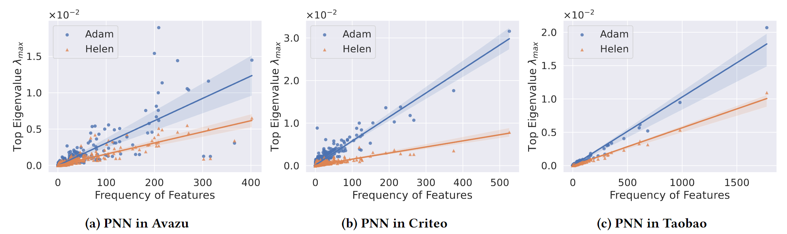

# Helen: Optimizing CTR Prediction Models with Frequency-wise Hessian Eigenvalue Regularization

<p align="center" width="100%">
      
</p>

Welcome to the official repository of the **Helen Optimizer**, a plug-and-play optimization algorithm tailored specifically for Click-Through Rate (CTR) prediction models.

Implemented in PyTorch, Helen is designed to seamlessly integrate into your CTR prediction workflows, enhancing the model performance by frequency-wise Hessian eigenvalue regularization. Dive deeper into the technicalities of Helen by reading our [paper](https://arxiv.org/abs/2403.00798).

Please star this repo and cite us if you find Helen useful. Thank you!
```tex
@inproceedings{zhu2024helen,
  author    = {Zhu, Zirui and Liu, Yong and Zheng, Zangwei and Guo, Huifeng and You, Yang},
  title     = {Helen: Optimizing CTR Prediction Models with Frequency-wise Hessian Eigenvalue Regularization},
  booktitle = {Proceedings of the ACM Web Conference 2024 (WWW '24)},
  year      = {2024},
  doi       = {10.1145/3589334.3645463},
  publisher = {ACM}
  }
```

## Optimizer Usage

It is easy to use Helen to train your own CTR prediction model.

There are three key steps in the update process of Helen: count the feature frequency, first step for perturbation, second step for real update.

```python
import torch
import torch.nn.functional as F
from optim import Helen

# init the optimizer
data, feature_specs = YourDataset()       # a map contains information like vocab_size

model = YourModel(data)                   # CTR prediction model is dependent on the data

feature_params_map = ...                  # a map from feature name to its parameters

embed_params = model.get_embed_params()   # get the embedding parameters
net_params = model.get_net_params()       # get the dense network parameters

optimizer = Helen(embed_params, net_params, lr_embed=1e-3, lr_net=1e-3, rho=0.05, net_pert=True, bound=0.3)

for X, y in data:
    # 1. count the occurrence of each feature in the batch
    optimizer.count_feature_occurrence(X, feature_params_map, feature_specs)
	
    # 2. first forward-backward pass
    loss = loss_function(model(X), y)
    optimizer.zero_grad()
    loss.backward()
    optimizer.first_step(zero_grad=True)
    
    # 3. second forward-backward pass
    loss = loss_function(model(X), y)
    loss.backward()
    optimizer.second_step()
```

The most tricky part is you need to construct a map from feature field to its corresponding embedding of the model. If your training pipeline is totally different from FuxiCTR, you may implement ```Helen.count_feature_occurrence```, which should be straightforward.

## Running Environment

We recommend using Docker for reproducing the experiments. 

Use the provided `Dockerfile` to build a Docker Image.

If docker is not available for your machine, here are some important dependencies.

- [pytorch](https://pytorch.org) 1.10
- [hydra-core](https://hydra.cc/docs/intro/) 1.2.0 
- tqdm 
- pandas 1.3.5 
- scipy 1.7.3 
- scikit-learn 1.0.2 
- h5py 3.7.0 
- tensorboard 2.10.1 

## Run the experiments

In our paper, we use three public datasets, Avazu, Criteo and Taobao, all preprocessed by [BARS](https://github.com/openbenchmark/BARS). 

Please follow their [instruction](https://github.com/reczoo/Datasets?tab=readme-ov-file#matching) to download the datasets.

To reproduce the results of DeepFM on Criteo datasets.

```bash
python main.py data=Criteo model=DeepFM optim=Helen optim.rho=0.05 optim.net_pert=True
```

We provide 7 models in this repo. You can specify the model by the args ```model``` in ```[DNN, WideDeep, PNN, DeepFM, DCN, DLRM, DCNv2]```.

## Acknowledgement
Our training code is based on [FuxiCTR](https://github.com/reczoo/FuxiCTR). The implementation of Helen is inspired by this wonderful [repo](https://github.com/davda54/sam). 
We sincerely thank for their wonderful work.
